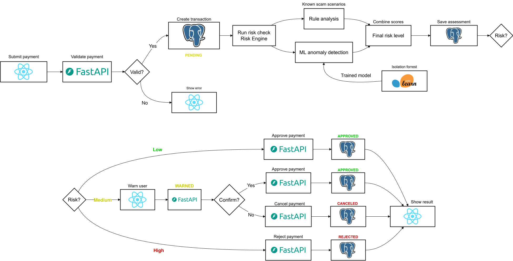

# SafeFlow AI

SafeFlow AI is a fintech payment-processing demo that evaluates every money transfer before it is settled. It combines deterministic fraud rules with machine-learning anomaly detection to decide whether a payment should be approved automatically, shown to the user for extra confirmation, or rejected.

The application is built as a full-stack project with a React frontend, a FastAPI backend, a PostgreSQL database, and a risk engine powered by rule analysis and an Isolation Forest anomaly model.

## The problem this project solves

Digital payments are fast, but speed also makes fraud harder to stop. A user may be tricked into sending money to a new beneficiary, pressured by urgent social-engineering messages, or slowly manipulated through small transfers before a larger suspicious payment. Traditional payment flows usually either accept the payment immediately or block it entirely, which creates two problems:

1. **Unsafe transfers can be settled too quickly.** Suspicious payments may leave the account before the user has a chance to reconsider.
2. **Legitimate payments can be blocked too aggressively.** A hard reject for every anomaly creates friction and a poor banking experience.

SafeFlow AI solves this by inserting an intelligent risk-check step into the payment flow. Each payment is scored before settlement, and the final decision controls the user journey:

- **Low risk**: the payment is approved and settled automatically.
- **Medium risk**: the payment is paused and the user must explicitly confirm it with a password.
- **High risk**: the payment is rejected before money moves.

This creates a safer payment experience without blocking every unusual transaction.

## Architecture

The diagram below shows the behind-the-scenes architecture and decision flow used by the application.



## How the payment flow works

1. The user starts in the React frontend and submits a payment request.
2. The FastAPI backend validates the request and creates a pending transaction.
3. PostgreSQL stores users, accounts, contacts, transactions, and risk assessments.
4. The backend sends the transaction through the risk engine.
5. The risk engine combines:
   - rule-based fraud signals, such as new beneficiary plus high amount, urgency keywords, night-time high-value transfers, and gradual trust-building behavior;
   - ML anomaly detection, using an Isolation Forest model trained on transaction behavior.
6. The backend calculates a combined risk score.
7. The transaction is mapped to a final outcome:
   - `LOW` -> `APPROVED` -> settlement is executed;
   - `MEDIUM` -> `WARNED` -> user must confirm with password;
   - `HIGH` -> `REJECTED` -> transfer is blocked.
8. The frontend displays the correct result screen: approved, proceed cautiously, or blocked.

## Key features

- User registration and login with access and refresh tokens.
- Protected dashboard and authenticated payment flow.
- Account lookup for the current user.
- Create, confirm, cancel, and inspect payments.
- Transaction history for the authenticated account.
- Risk assessment for every payment.
- Rule-based scoring for known fraud patterns.
- Machine-learning anomaly score using a saved Isolation Forest model.
- Automatic settlement for safe payments.
- Password confirmation for warned payments.
- PostgreSQL seed data with realistic users, accounts, transactions, contacts, and risk assessments.
- Clear layered backend architecture: router, service, repository, database.

## Tech stack

### Frontend

- React 18
- React Router
- Vite
- CSS modules

### Backend

- FastAPI
- SQLAlchemy
- Pydantic
- PostgreSQL
- psycopg
- scikit-learn
- pandas
- joblib

### Infrastructure and tooling

- Docker Compose for local PostgreSQL
- uv / Python project configuration
- Seed SQL scripts for demo data


## Backend architecture

The backend follows a layered architecture:

```text
Router -> Service -> Repository -> Database
```

### Router layer

Located in `app/api/routes/`.

Routers define HTTP endpoints, parse request payloads, call services, and translate service errors into HTTP responses. They do not contain core business logic.

Main route groups:

- `auth.py`: registration, login, token refresh, current user, logout
- `accounts.py`: current account lookup
- `payments.py`: create, confirm, and cancel payments
- `transactions.py`: list and inspect transactions

### Service layer

Located in `app/services/`.

Services contain the business rules and orchestration logic. Important services include:

- `auth_service.py`: user registration, login, token generation, password verification
- `payment_service.py`: payment lifecycle orchestration
- `risk_service.py`: rule score plus anomaly score aggregation
- `rule_score_service.py`: deterministic fraud signal scoring
- `anomaly_score_service.py`: Isolation Forest model loading and scoring
- `settlement_service.py`: balance movement and transaction settlement
- `transaction_service.py`: transaction history and detail access
- `account_service.py`: account access for the current user

### Repository layer

Located in `app/repositories/`.

Repositories own database queries and persistence operations. This keeps SQLAlchemy access separate from business logic.

### Database layer

Located in `app/db/` and `dev/`.

The application uses PostgreSQL with the following main tables:

- `users`
- `accounts`
- `contacts`
- `transactions`
- `risk_assessments`

## Risk engine

SafeFlow AI calculates risk using two complementary approaches.

### Rule score

The rule engine looks for interpretable fraud patterns, including:

- New beneficiary with a high-value transfer.
- Suspicious or urgent language in the payment description.
- Night-time high-value transfer behavior.
- Gradual trust-building, where several small transfers are followed by a large one.

### ML anomaly score

The ML component uses an Isolation Forest model. The model produces a raw anomaly signal, which is normalized into a project-level score:

```text
0.0 = normal behavior
1.0 = highly anomalous behavior
```

The trained model bundle is stored in:

```text
app/ml_models/isolation_forest_global.joblib
```

If the model needs to be recreated, run:

```bash
python -m scripts.train_anomaly_model
```

### Final risk score

The final combined score is calculated from:

```text
combined_score = 0.60 * rule_score + 0.40 * anomaly_score
```

The score is then mapped to a decision:

| Combined score | Risk level | Decision | Payment status |
| --- | --- | --- | --- |
| `< 0.40` | `LOW` | `ALLOW` | `APPROVED` then `SETTLED` |
| `>= 0.40` and `< 0.70` | `MEDIUM` | `WARN` | `WARNED` |
| `>= 0.70` | `HIGH` | `REJECT` | `REJECTED` |

## Payment lifecycle

```text
PENDING
  -> LOW risk
      -> APPROVED
      -> SETTLED

PENDING
  -> MEDIUM risk
      -> WARNED
      -> user confirms with password
      -> SETTLED

PENDING
  -> HIGH risk
      -> REJECTED
```

The user can also cancel a payment while it is not settled, canceled, or rejected.

## API overview

### Auth

| Method | Endpoint | Description |
| --- | --- | --- |
| `POST` | `/auth/register` | Register a new user and create an account |
| `POST` | `/auth/login` | Login with email and password |
| `POST` | `/auth/token` | OAuth2-compatible token endpoint |
| `GET` | `/auth/me` | Return the authenticated user |
| `POST` | `/auth/refresh` | Refresh access token |
| `POST` | `/auth/logout` | Logout response endpoint |

### Accounts

| Method | Endpoint | Description |
| --- | --- | --- |
| `GET` | `/api/accounts/me` | Return the current user's account |

### Payments

| Method | Endpoint | Description |
| --- | --- | --- |
| `POST` | `/api/payments` | Create a new payment and run risk evaluation |
| `POST` | `/api/payments/{payment_id}/confirm` | Confirm a warned payment with password |
| `POST` | `/api/payments/{payment_id}/cancel` | Cancel a pending or warned payment |

### Transactions

| Method | Endpoint | Description |
| --- | --- | --- |
| `GET` | `/api/transactions/me` | List current account transactions |
| `GET` | `/api/transactions/{transaction_id}` | Get transaction details and risk assessment |

## Getting started

### Prerequisites

- Python 3.14 or compatible project environment
- Node.js 18+
- npm
- Docker and Docker Compose
- PostgreSQL client tools are optional but useful for debugging

### 1. Clone the repository

```bash
git clone https://github.com/<your-username>/SafeFlow-AI.git
cd SafeFlow-AI
```

### 2. Start the PostgreSQL database

```bash
cd shared
docker compose up -d --build
cd ..
```

The local database is exposed on port `5433` and is initialized with the SQL scripts in `shared/`.


### 3. Install backend dependencies

Using uv:

```bash
uv sync
```

Or with pip:

```bash
python -m venv .venv
source .venv/bin/activate
pip install -e .
```

On Windows PowerShell:

```powershell
python -m venv .venv
.\.venv\Scripts\Activate.ps1
pip install -e .
```

### 4. Run the backend

```bash
uvicorn app.main:app --reload
```

The API will be available at:

```text
http://localhost:8000
```

FastAPI interactive documentation:

```text
http://localhost:8000/docs
```

### 5. Install frontend dependencies

```bash
cd frontend
npm install
```

### 6. Run the frontend

```bash
npm run dev
```

The frontend will be available at:

```text
http://localhost:5173
```

If the frontend and backend run on different origins, create `frontend/.env`:

```env
VITE_API_BASE=http://localhost:8000
```

## Example payment request

After logging in, create a payment with:

```http
POST /api/payments
Authorization: Bearer <access-token>
Content-Type: application/json
```

```json
{
  "receiver_iban": "RO49AAAA1B31007500000002",
  "amount": 1500.00,
  "currency": "EUR",
  "description": "Urgent invoice payment, please transfer now"
}
```

Depending on the risk score, the response will return a transaction with a status such as `SETTLED`, `WARNED`, or `REJECTED`.

## User experience

The frontend guides the user through the full payment journey:

- Login and registration screens.
- Dashboard with account context.
- Send-money form.
- Risk evaluation loading screen.
- Approved screen for safe transfers.
- Caution screen for medium-risk transfers requiring confirmation.
- Blocked screen for high-risk transfers.
- Transaction history screen.

## Development notes

- Keep route files thin. Business logic belongs in services.
- Keep SQLAlchemy queries inside repositories.
- Keep request and response contracts in Pydantic schemas.
- Keep database schema changes in SQL or migration artifacts, not in service logic.
- Re-train the anomaly model after changing feature engineering.
- The included seed data is for local development and demonstration only.

## Future improvements

- Add automated unit and integration tests.
- Add Alembic migrations.
- Add CI checks for backend and frontend.
- Add model monitoring and model versioning.
- Add richer explainability for the risk decision shown to the user.
- Add admin dashboards for reviewing rejected or warned transactions.

## License

This project is intended as a demo/educational fintech application. Add your preferred license before publishing the repository.
